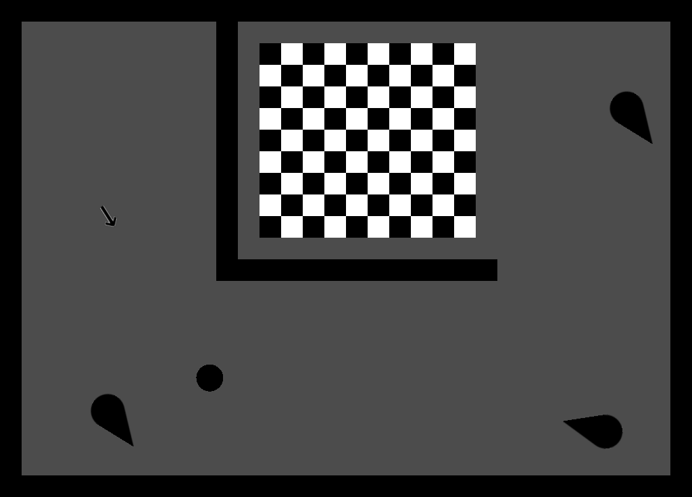

Nacaçapa
========
Mire com o mouse e jogue a bolinha na chegada (quadriculado branco e preto)!

Jogo produzido como exemplo para um workshop de [Godot](https://godotengine.org/)
realizado para a [LivreJam 2017](https://livregamejam.org/).

Assets utilizados:
- Ball Hopping, por RuonVNiekerk (https://freesound.org/s/327907/). O som
  original foi recortado. Licensa: [CC BY 3.0](https://creativecommons.org/licenses/by/3.0/).
